NPS Lab Tour
========================================================
author: Collin Erickson
date: 8/2/16
autosize: true

Design of Experiments / Simulation
========================
- Suppose you can simulate a battle
- There are many variables: Red/blue, # soldiers, # ammo
- You want to understand what the result of simulation will be
- But a single simulation takes hours to run

=========
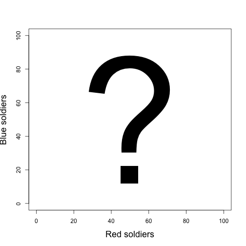

=========
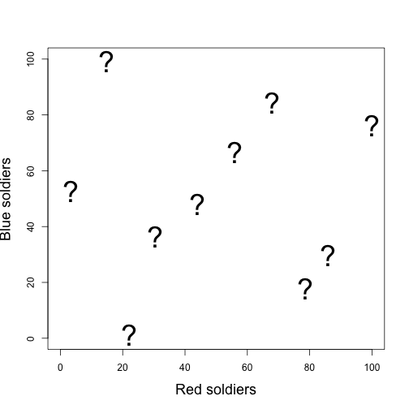

=========
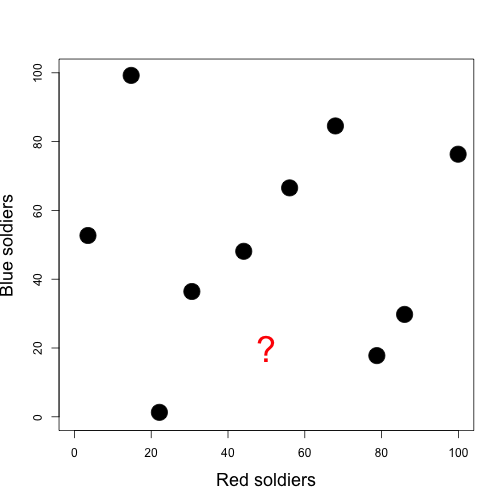

Sequential simulation
========
- Run n simulations
- Fit a model that lets you predict at other points
- Pick new simulations to run: which points do you want to add?
  - Add points where predictions are most uncertain
- Repeat

========

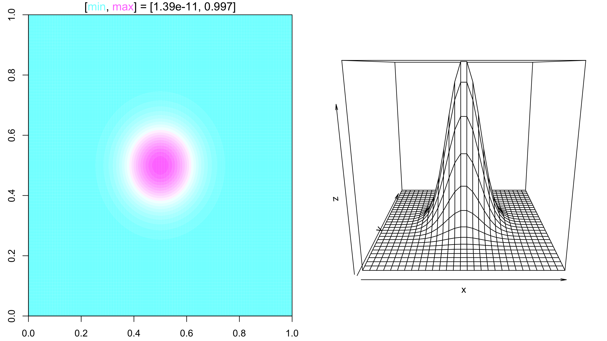

==========
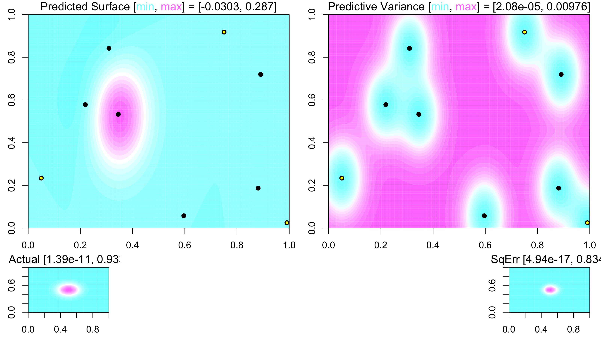

==========
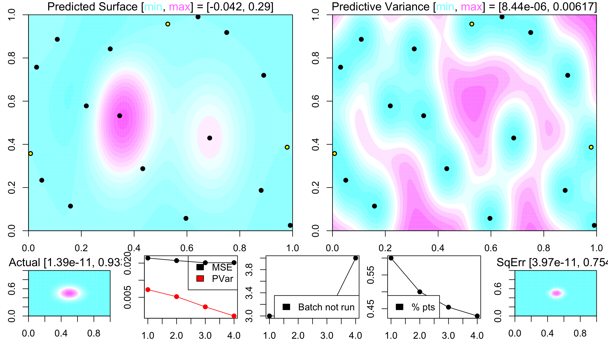

==========
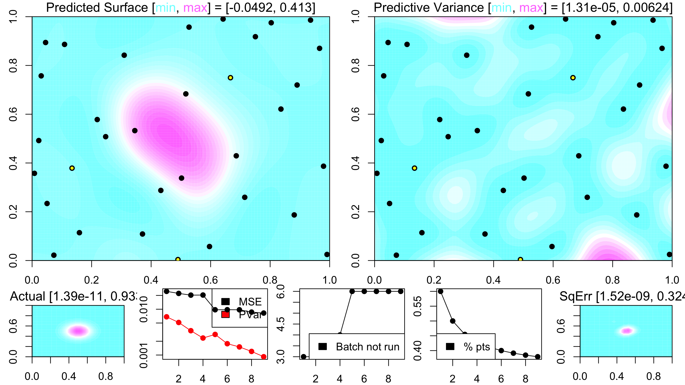

==========
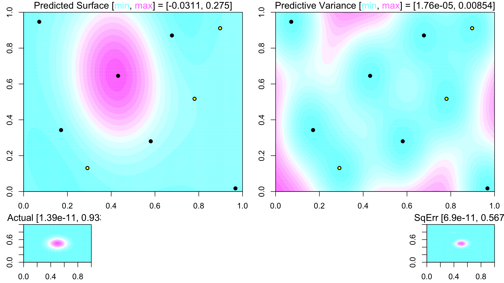

==========
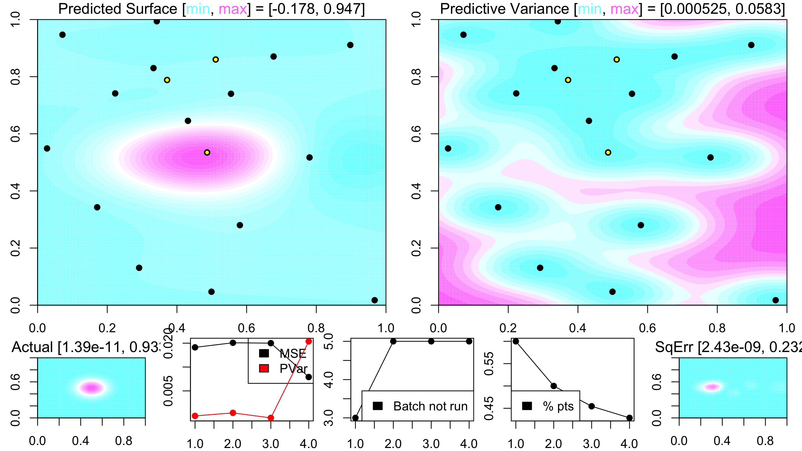

==========
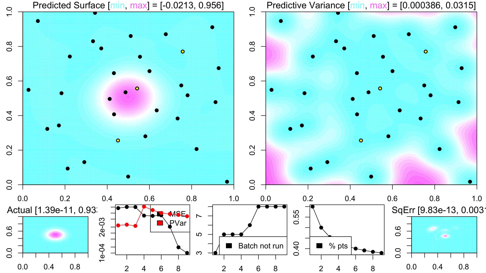

===========
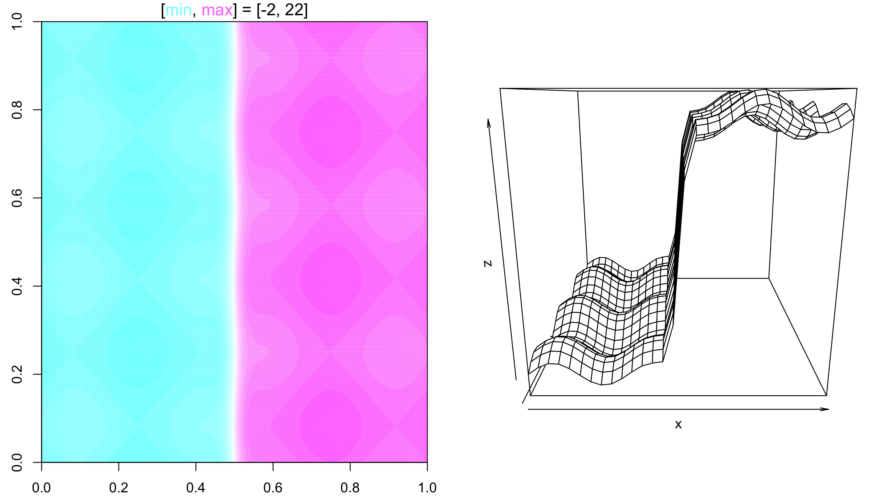

==========
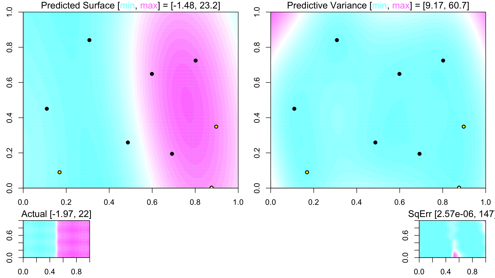

==========
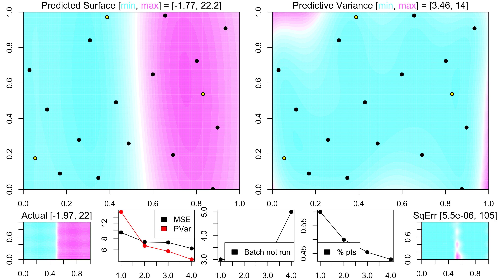

==========
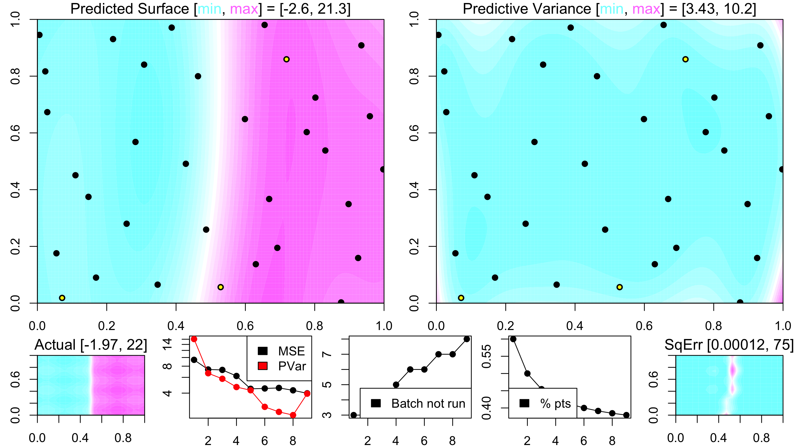

==========
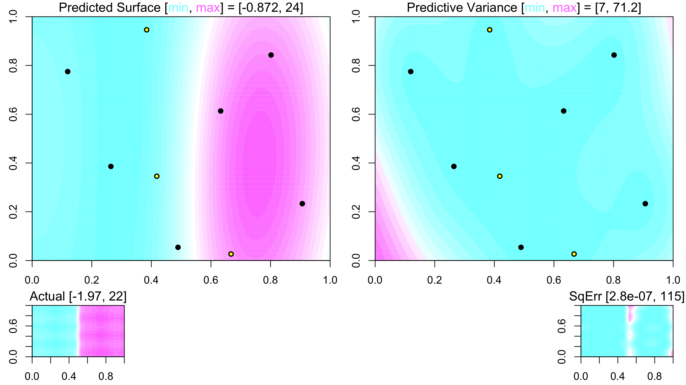

==========
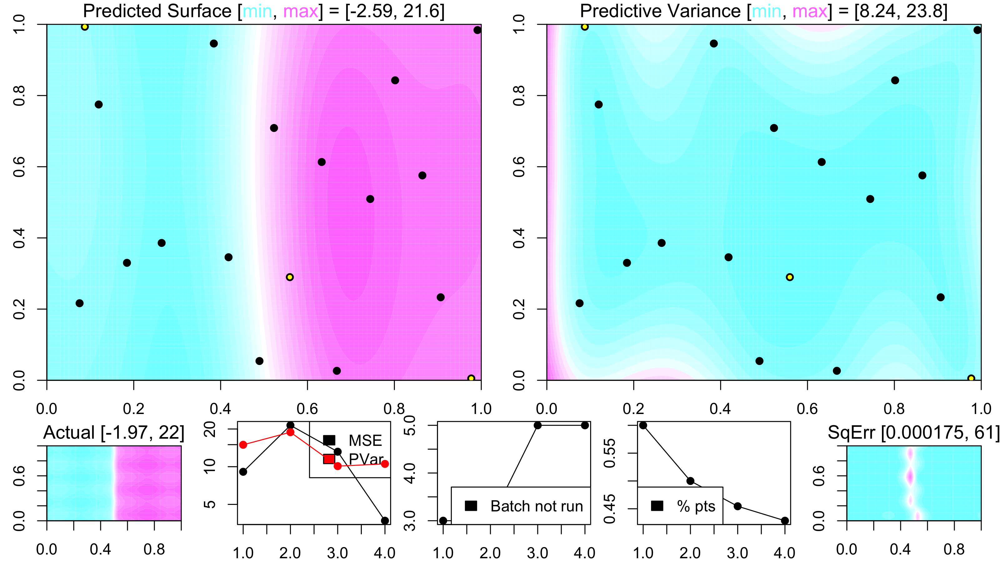

==========
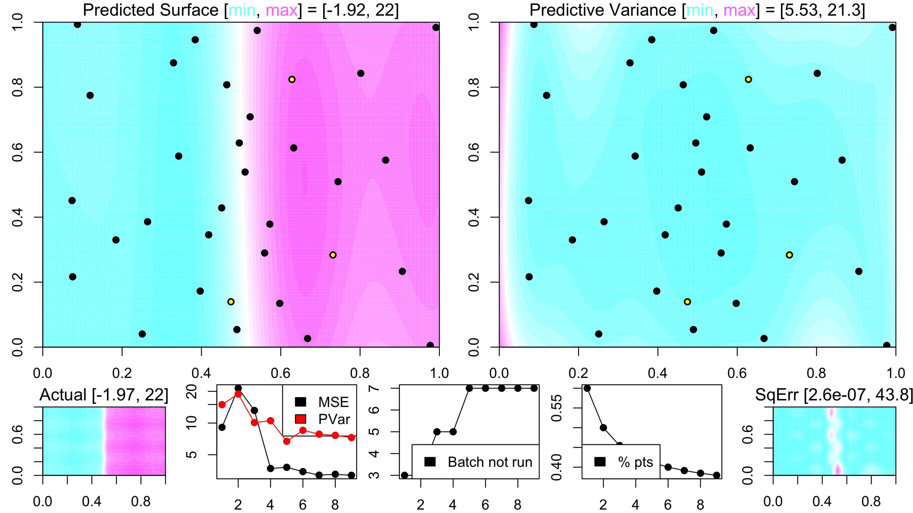
