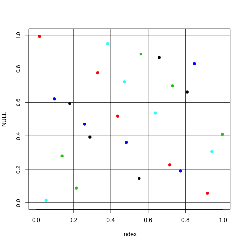
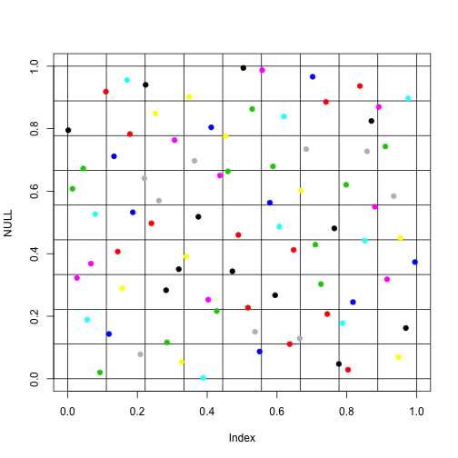
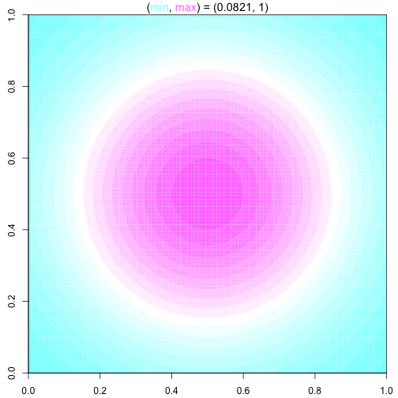
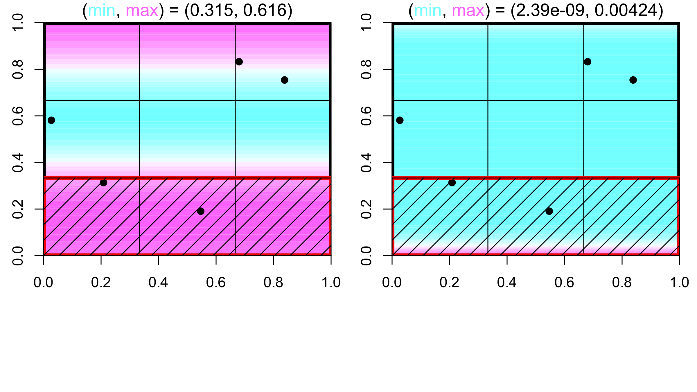
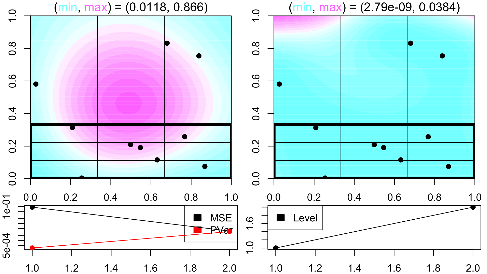
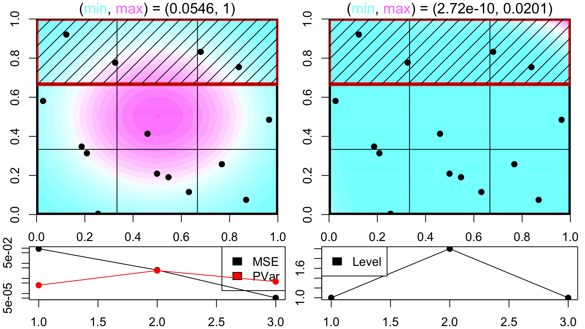
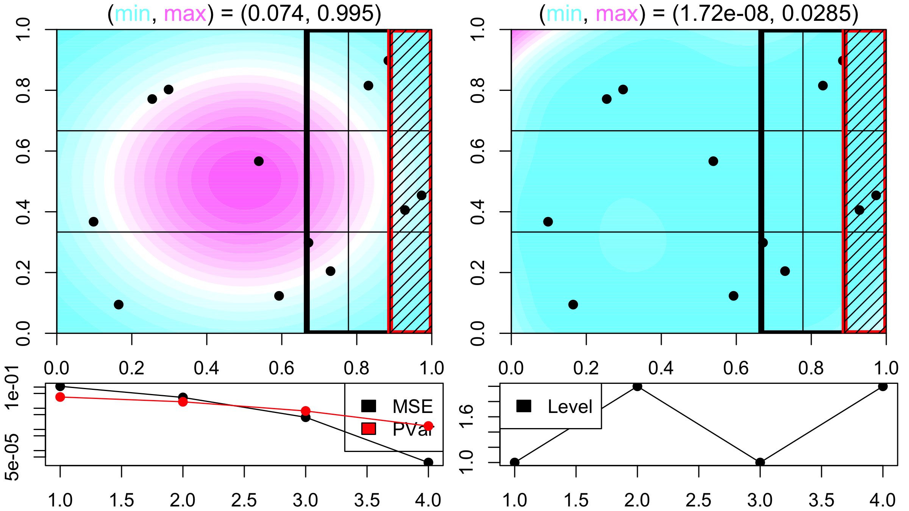
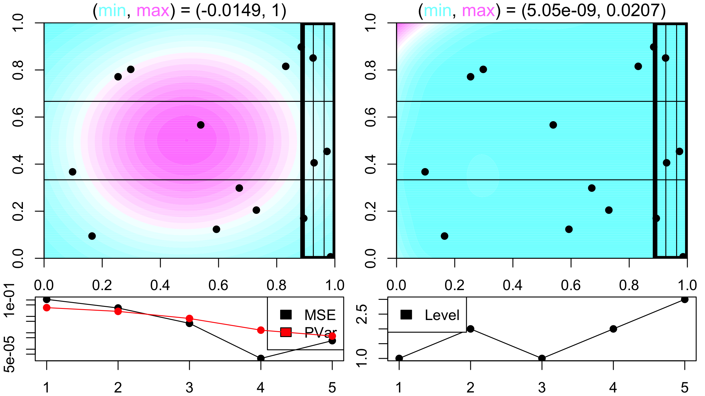
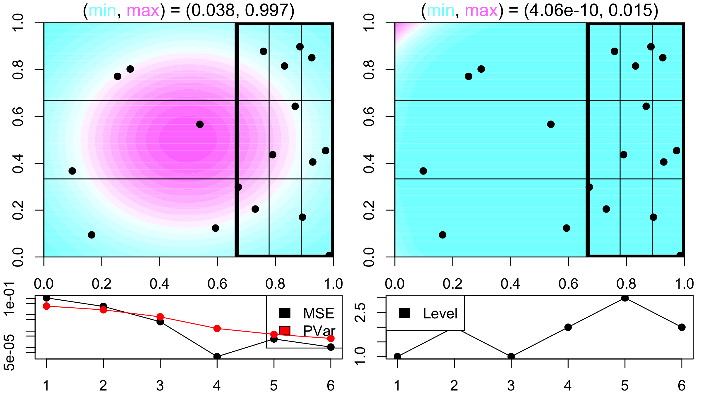
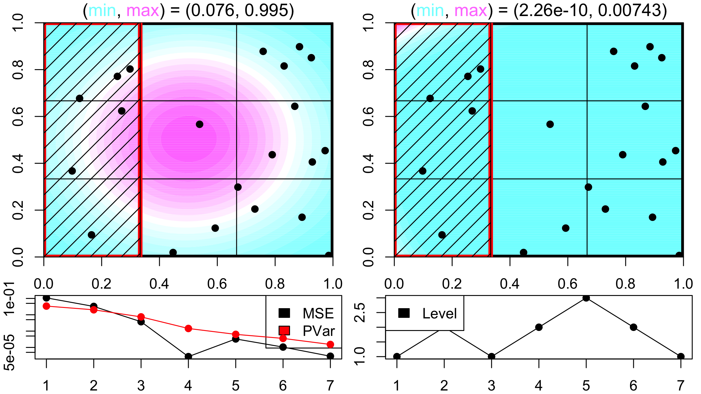

adaptconcept_sFFLHD_RC
========================================================
author: Collin Erickson
date: 7/13/2016
autosize: true
width: 1920
height: 1080

What I've worked on
=====================

- Implemented sFFLHD
- Adaptive sampling concept
 - Sample, then focus on subregion or return up level
- Combined these two to get adaptive sFFLHD sampling

sFFLHD
================


```r
s <- sFFLHD.seq(D = 3, L = 5)
s$get.batch()
```

```
          [,1]      [,2]       [,3]
[1,] 0.8382688 0.5280977 0.74472828
[2,] 0.5814938 0.6391916 0.02985124
[3,] 0.7542784 0.1638133 0.80409794
[4,] 0.1813992 0.9460096 0.40016803
[5,] 0.3191431 0.2637954 0.23064120
```

sFFLHD plot test
=============== 

```r
s <- sFFLHD.seq(D = 2, L = 5)
plot(NULL, xlim=0:1, ylim=0:1)
abline(h=(0:5)/5, v=(0:5)/5)
for(i in 1:5) points(s$get.batch(), col=i, pch=19)
```



***


```r
s <- sFFLHD.seq(D = 2, L = 3)
l <- 9
plot(NULL, xlim=0:1, ylim=0:1)
abline(h=(0:l)/l, v=(0:l)/l)
for(i in 1:27) points(s$get.batch(), col=i, pch=19)
```



```
[1] "Going one deeper"
```


Example
================


Actual function: Gaussian


```r
contourfilled.func(gaussian1)
```




Adaptive sFFLHD
===============
title: FALSE



a
===========
title: FALSE




a
===========
title: FALSE



a
===========
title: FALSE



a
===========
title: FALSE




a
===========
title: FALSE



a
===========
title: FALSE


