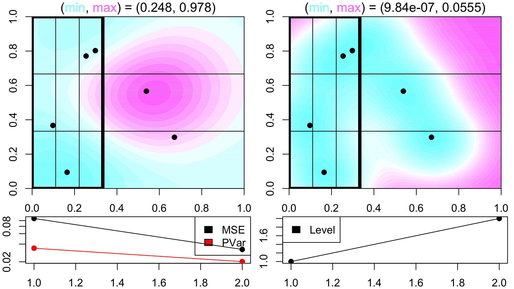

Adaptive sFFLHD sampling concept
========================================================
author: Collin Erickson
date: 7/13/2016
autosize: true
width: 1920
height: 1080

What I've worked on
=====================

- Implemented sFFLHD
- Adaptive sampling concept
 - Sample, then focus on subregion or return up level
- Combined these two to get adaptive sFFLHD sampling

sFFLHD
================


```r
s <- sFFLHD.seq(D = 3, L = 5)
s$get.batch()
```

```
           [,1]       [,2]       [,3]
[1,] 0.80704681 0.76735849 0.02498429
[2,] 0.07001103 0.54852614 0.76341669
[3,] 0.61340117 0.82163175 0.58389773
[4,] 0.37208543 0.32099826 0.25862690
[5,] 0.59966032 0.05542548 0.85744879
```

sFFLHD plot test
=============== 

```r
s <- sFFLHD.seq(D = 2, L = 5)
plot(NULL, xlim=0:1, ylim=0:1)
abline(h=(0:5)/5, v=(0:5)/5)
for(i in 1:5) points(s$get.batch(), col=i, pch=19)
```


***


```r
s <- sFFLHD.seq(D = 2, L = 3)
l <- 9
plot(NULL, xlim=0:1, ylim=0:1)
abline(h=(0:l)/l, v=(0:l)/l)
for(i in 1:27) points(s$get.batch(), col=i, pch=19)
```


```
[1] "Going one deeper"
```


Example: Gaussian
================


Actual function: Gaussian


```r
contourfilled.func(gaussian1)
```


Adaptive sFFLHD
===============
title: FALSE


a2
===========
title: FALSE




a3
===========
title: FALSE


a4
===========
title: FALSE


a5
===========
title: FALSE


a6
===========
title: FALSE


a7
===========
title: FALSE


a8
===========
title: FALSE


a9
===========
title: FALSE


a10
===========
title: FALSE


```
[1] "Going one deeper"
```


Example: Sinumoid
================


Actual function: Sinusoid with a plateau


```r
contourfilled.func(sinumoid)
```


Adaptive sFFLHD
===============
title: FALSE


a2
===========
title: FALSE


a3
===========
title: FALSE


a4
===========
title: FALSE


a5
===========
title: FALSE


a6
===========
title: FALSE


a7
===========
title: FALSE


```
[1] "Going one deeper"
```


a8
===========
title: FALSE


a9
===========
title: FALSE


a10
===========
title: FALSE


