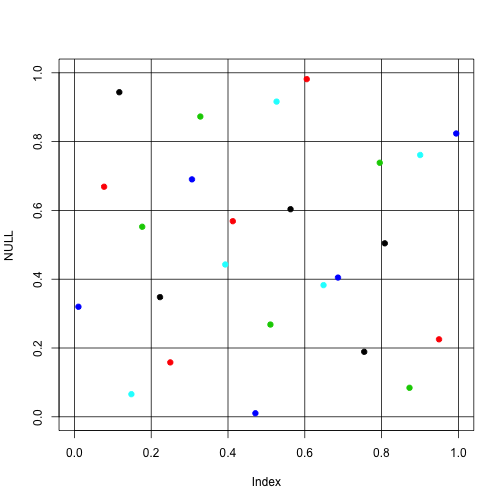
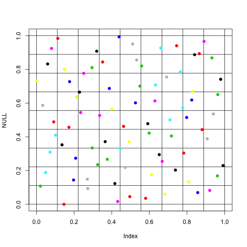

Adaptive sFFLHD sampling concept
========================================================
author: Collin Erickson
date: 7/13/2016
autosize: true
width: 1920
height: 1080

What I've worked on
=====================

- Implemented sFFLHD
- Adaptive sampling concept
 - Sample, then focus on subregion or return up level
- Combined these two to get adaptive sFFLHD sampling

sFFLHD
================


```r
s <- sFFLHD.seq(D = 3, L = 5)
s$get.batch()
```

```
          [,1]      [,2]       [,3]
[1,] 0.4487275 0.1546214 0.63683854
[2,] 0.8692047 0.6563524 0.54794621
[3,] 0.3899240 0.3383302 0.23503432
[4,] 0.1440594 0.5588453 0.80831719
[5,] 0.6677126 0.9407938 0.05996466
```

sFFLHD plot test
=============== 

```r
s <- sFFLHD.seq(D = 2, L = 5)
plot(NULL, xlim=0:1, ylim=0:1)
abline(h=(0:5)/5, v=(0:5)/5)
for(i in 1:5) points(s$get.batch(), col=i, pch=19)
```



***


```r
s <- sFFLHD.seq(D = 2, L = 3)
l <- 9
plot(NULL, xlim=0:1, ylim=0:1)
abline(h=(0:l)/l, v=(0:l)/l)
for(i in 1:27) points(s$get.batch(), col=i, pch=19)
```



```
[1] "Going one deeper"
```

Can't open file adaptconcept_sFFLHD_RC.R (others are fine), if want to run it have to move files
==========================

```r
#source("../adaptconcept_sFFLHD_RC.R")
#source("../adaptconcept_sFFLHD_RC.R")
list.files('..')
```

```
 [1] "adaptconcept_helpers.R"             
 [2] "adaptconcept_sFFLHD_2D.R"           
 [3] "adaptconcept_sFFLHD_RC_presentation"
 [4] "adaptconcept_sFFLHD_RC.R"           
 [5] "adaptconcept_sFFLHD.R"              
 [6] "adaptconcept.R"                     
 [7] "DOE-code.Rproj"                     
 [8] "LHS.R"                              
 [9] "MMA.R"                              
[10] "OA.R"                               
[11] "OAL2mL2.R"                          
[12] "OLHD.R"                             
[13] "README.md"                          
[14] "sFFLHD.R"                           
[15] "SLHD.R"                             
[16] "SLHDvOA.R"                          
[17] "slicelhsgeneratetest.R"             
[18] "test_treestuff.R"                   
```

```r
dir('..')
```

```
 [1] "adaptconcept_helpers.R"             
 [2] "adaptconcept_sFFLHD_2D.R"           
 [3] "adaptconcept_sFFLHD_RC_presentation"
 [4] "adaptconcept_sFFLHD_RC.R"           
 [5] "adaptconcept_sFFLHD.R"              
 [6] "adaptconcept.R"                     
 [7] "DOE-code.Rproj"                     
 [8] "LHS.R"                              
 [9] "MMA.R"                              
[10] "OA.R"                               
[11] "OAL2mL2.R"                          
[12] "OLHD.R"                             
[13] "README.md"                          
[14] "sFFLHD.R"                           
[15] "SLHD.R"                             
[16] "SLHDvOA.R"                          
[17] "slicelhsgeneratetest.R"             
[18] "test_treestuff.R"                   
```


Example: Gaussian
================


```
Error in file(filename, "r", encoding = encoding) : 
  cannot open the connection
```
