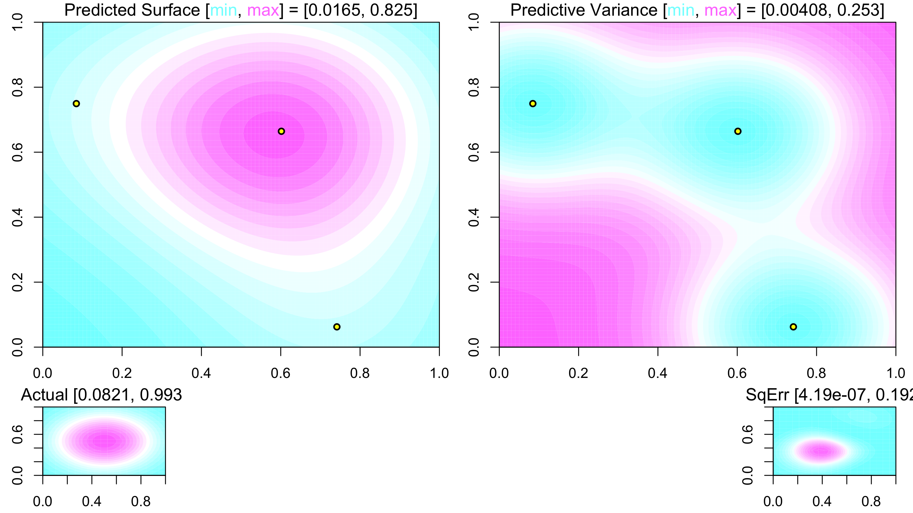
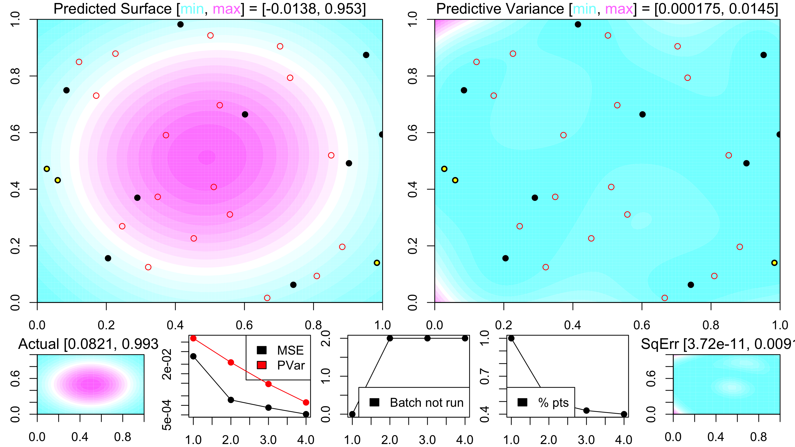
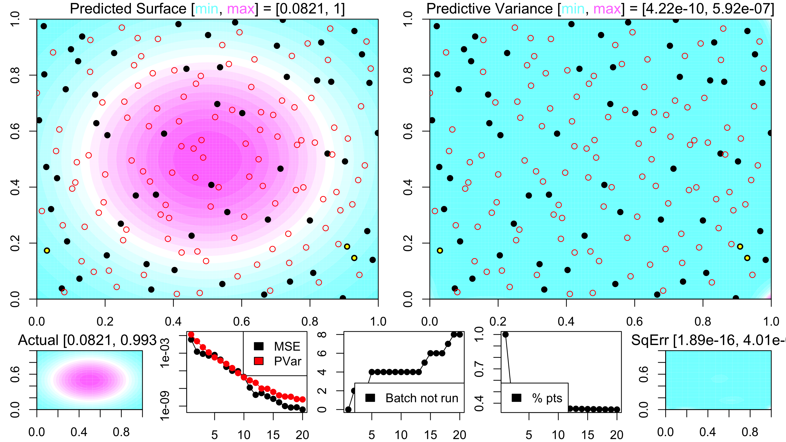
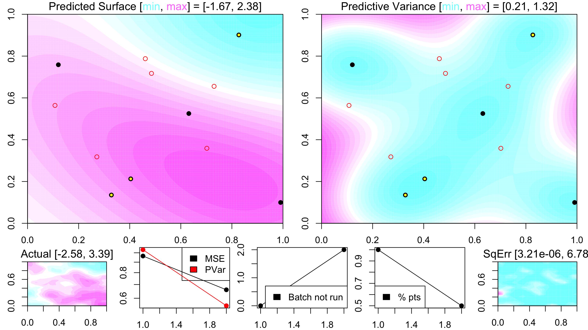

Adaptive sampling discussion
========================================================
author: Collin Erickson
date: 7/28/16
autosize: true

What I was doing before seems overcomplicated
==================
- Boxes are arbitrary
- Points taken from boxes are just next ones from design
- E.g. problem: focused on a box because of the corner
- Box levels limit point selection unnecessarily

Goal
=============
- Adaptive design that is space-filling
- Balance between gooal design and focus on interesting areas
- Good design => Just use sFFLHD and take slices
- Adaptive => Pick optimum points based on criterion
- We need to balance these
- Give n options taken from design, let it pick best

Give n options taken from design, let it pick best
=============
- Idea: keep set of n points taken from design, pick "best" to run
- n = 1 => Normal design
- n = $\infty$ => Adaptive with no restrictions

Problem: quickly all n points will uninteresting
============
- Will just use the next point selected
- Will essentially become the design
- Solution: Let n increase over time
- How should n increase?
- Queue will become very long
- Lots of recomputing

Problem: No guarantee on acheiving design stages
===========
- Points could stay in queue forever
- Solution: occasionally take points that have in queue longest
- E.g. every tenth batch (or 10% each batch) is oldest in queue

Problem: Lots to recalculate
===============
- Only recalculate the ones that were nearly selected 
- Or ones that haven't been recalculated recently

Problem: points selected will be close to each other
==================
- Enforce slice/LH in some way?
- Mix in oldest in queue with best
- Active learning
- Mutual information?

PROBLEM!!!
==================
- GP predictive variance doesn't depend on Y values
- Only on design X and parameters (implicit Y)
- So space-filling does best at minimizing pvar (and MSE?)
- Reducing pvar not best use of adaptive
- Not a problem if searching for max or other response-based criterion

Working idea
======
- Take 3 batches of size L at each iteration
- Select L best
- 20% of batches are just oldest points in queue

================

=============

=============

=============

=============

=============

=============

=============

=============

=============

=============

